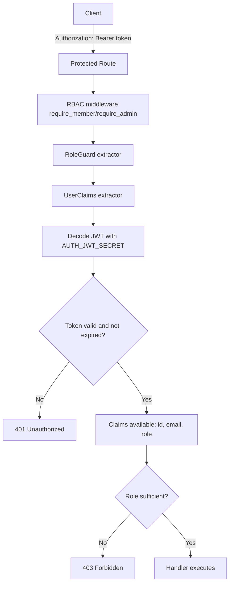

# AUTH-006 - RBAC Extractor and Guard

Date: 2026-04-02
Tickets:
- AUTH-006-RBAC-EXTRACTOR
- AUTH-006-RBAC-GUARD
- AUTH-006-RBAC-ROUTES

## Goal
Ajouter une couche RBAC simple et testee sur Axum:
- extraire les claims JWT depuis Authorization Bearer
- verifier le role requis sur les routes protegees
- retourner 401 pour token invalide/expire
- retourner 403 pour role insuffisant

## Components Added
- auth/extractor.rs
  - UserClaims { id, email, role }
  - impl FromRequestParts pour decoder/verifier le JWT
- auth/rbac.rs
  - RequiredRole { Member, Admin }
  - RoleGuard(RequiredRole)
  - impl FromRequestParts pour check role
  - middleware helpers require_member / require_admin
- app.rs
  - GET /members/profile (requires Member)
  - GET /admin/users (requires Admin)

## Integration Example

### 1) Protected routes in router
```rust
use crate::auth::{
    extractor::UserClaims,
    rbac::{require_admin, require_member, RequiredRole, RoleGuard},
};
use axum::{middleware::from_fn, routing::get, Json, Router};

fn router_with_state(state: AppState) -> Router {
    Router::new()
        .route(
            "/members/profile",
            get(members_profile).route_layer(from_fn(require_member)),
        )
        .route(
            "/admin/users",
            get(admin_users).route_layer(from_fn(require_admin)),
        )
        .with_state(state)
}
```

### 2) Member route handler
```rust
async fn members_profile(
    guard: RoleGuard,
    UserClaims { id, email, role }: UserClaims,
) -> Json<Value> {
    assert_eq!(guard.0, RequiredRole::Member);
    Json(json!({
        "id": id.to_string(),
        "email": email,
        "role": role,
    }))
}
```

### 3) Admin route handler
```rust
async fn admin_users(
    guard: RoleGuard,
    UserClaims { email, .. }: UserClaims,
) -> Json<Value> {
    assert_eq!(guard.0, RequiredRole::Admin);
    Json(json!({
        "items": [
            {"email": email, "note": "admin_context"}
        ]
    }))
}
```

## JWT Flow Diagram


## RBAC Matrix

| Route | Required Role | Member Token | Admin Token | Missing/Invalid Token |
|---|---|---|---|---|
| GET /members/profile | Member | 200 OK | 200 OK | 401 Unauthorized |
| GET /admin/users | Admin | 403 Forbidden | 200 OK | 401 Unauthorized |

Role rules:
- Member route accepte Member et Admin
- Admin route accepte seulement Admin

## Validation Tests
Extractor tests:
- test_extract_valid_jwt
- test_extract_missing_header
- test_extract_invalid_signature
- test_extract_expired_token

RBAC guard tests:
- test_member_can_access_member_route
- test_member_cannot_access_admin_route
- test_admin_can_access_everything

Protected routes tests:
- test_signup_login_then_access_members_profile
- test_login_as_non_admin_then_admin_users_forbidden

## Statut
- Extractor: done
- Guard: done
- Protected routes: done
- Test suite: green
